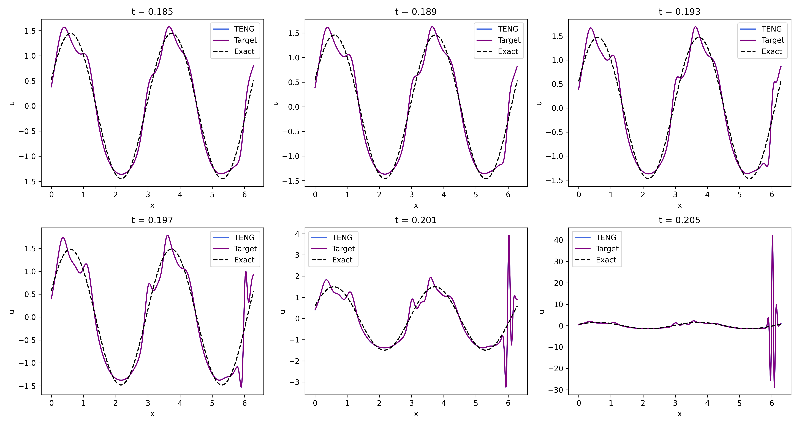
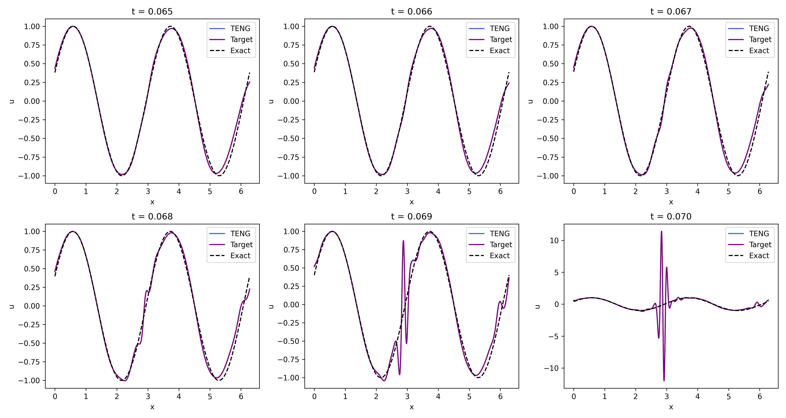
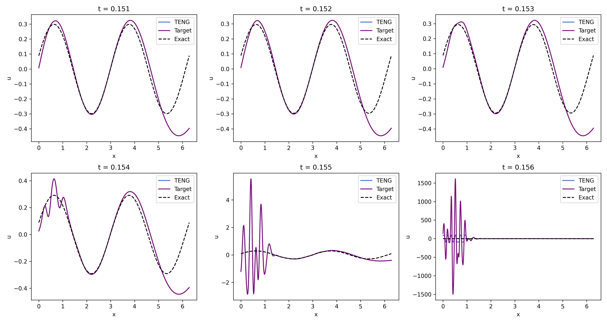

Currently TENG solutions for the considered equations cant be considered successful, see the Figures. At first it seemed that TENG has same instability issues as FD method, but then this behaviour would be also observed in the simplest equation (and it wasn't). What actually happens is caused by the equations, which naturally amplify any small short-wave fluctuation, extending it to a wave with huge amplitude (which is indeed a solution, but not for our problem).

   
  <em>Figure 1: TENG solution of the second order equation (time slices with step 0.004)</em>

---   

   
  <em>Figure 2: TENG solution of the third order equation (time slices with step 0.001)</em>

---   

   
  <em>Figure 3: TENG solution of the fourth order equation  (time slices with step 0.001)</em>

