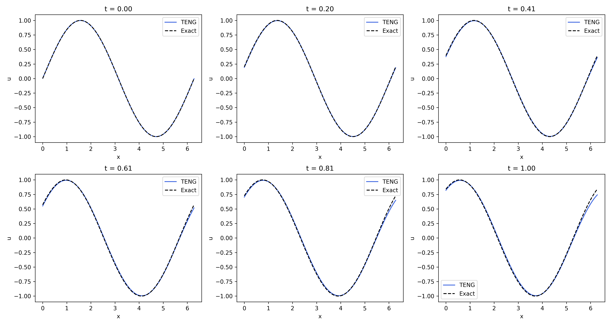
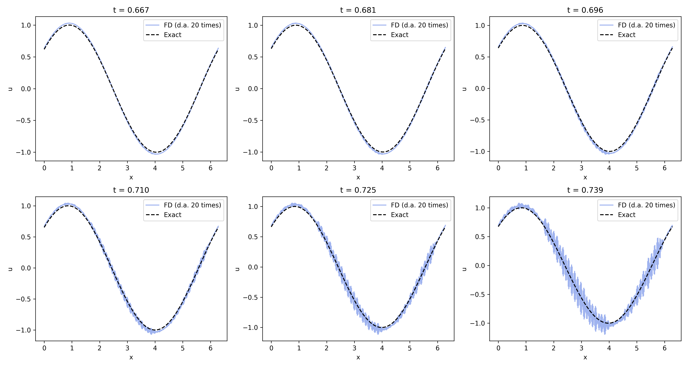

In this experiment TENG was also given same mesh of points as for unstable FD scheme.

However the results dont show any instability:  

   
  <em>Figure 1: TENG solution</em>

It is interesting to compare it with FD scheme:  

   
  <em>Figure 2: FD solution</em>

TENG seems to be unconditionally stable because it does not amplify sharp local deviations that occur during computations.
Below there are figures with 6 consequent slices of both schemes. 
Deviations from exact solution are artificially displayed larger than they are in reality:   
'd.a. 20 times' means that instead of $u$ we use $u_{da} = u_{exact} + 20*(u-u_{exact})$  

   
  <em>Figure 3: TENG deviation</em>

   
  <em>Figure 4: FD deviation</em>

